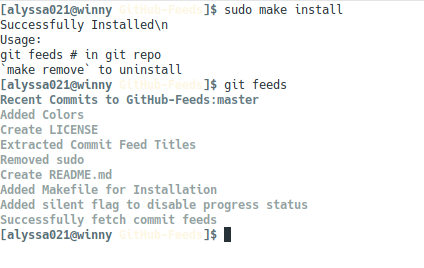

# GitHub-Feeds
Get your GitHub repository feeds in your Terminal. It shows commits in current branch of remote repository.

**Installation**
```bash
$ sudo make install
$ sudo make remove # to uninstall
```

**Usage**
```bash
$ git feeds # in git repository
```

